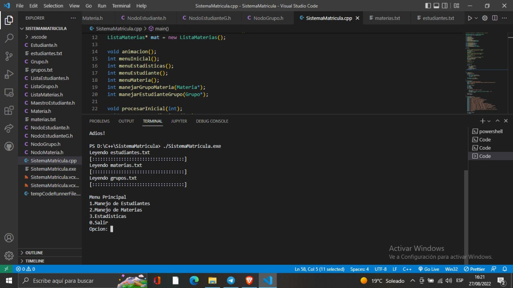
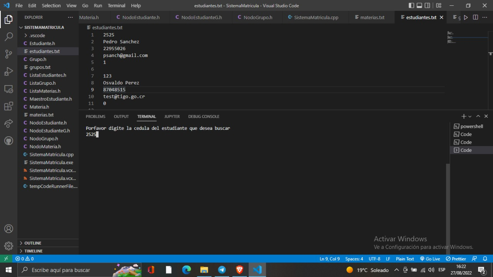
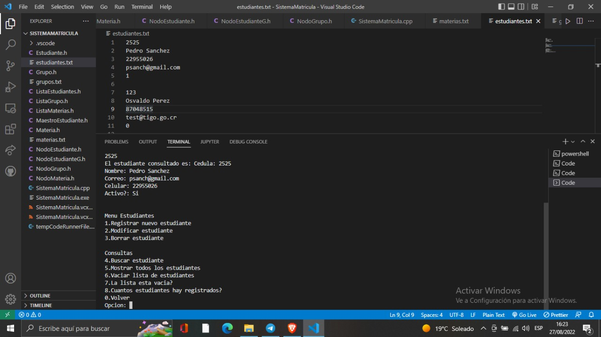
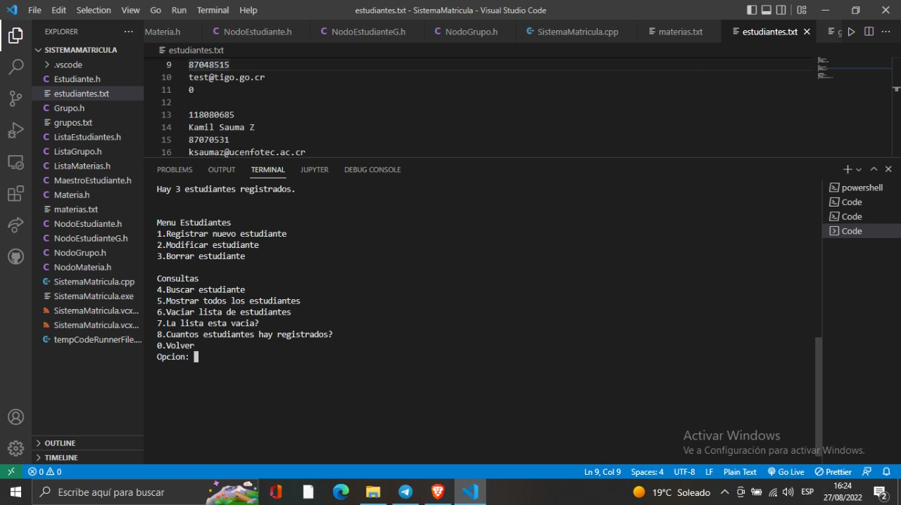
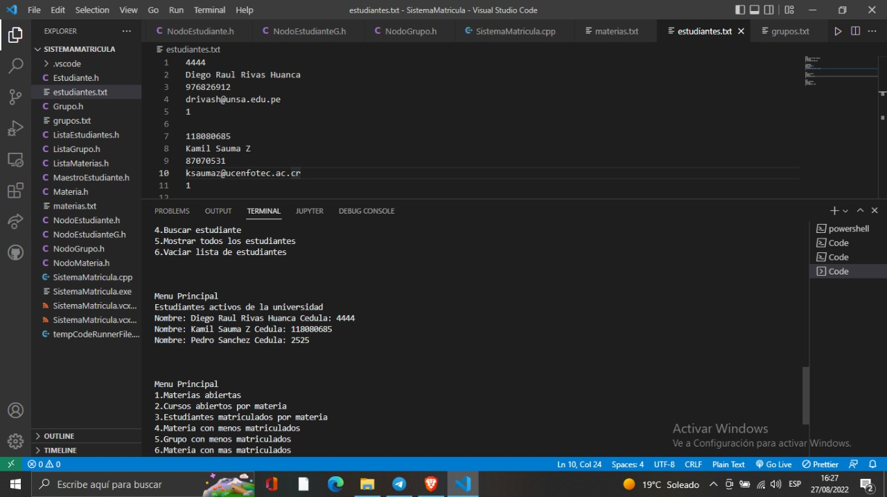

# :mortar_board: Sistema de matriculas con C++ 17
# Programa que ayuda al usuario a poder registrar las matriculas de diversos cursos y diferentes alumnos

## Grupo 6: Jheeremy Manuel Alvarez Astete(jalvarezas@unsa.edu.pe) , Diego Raul Rivas Huanca (drivash@unsa.edu.pe), César Gonzalo Carpio Paiva (ccarpiop@unsa.edu.pe)

<div align="center">

  
  <h1>Sistema de matriculas</h1>
  
  <p>
    Proyecto final de Analisis y Diseño de Algoritmos 
  </p>
  
  
<!-- Badges -->
   
<h4>
    <a href="https://github.com/Louis3797/awesome-readme-template/">View Demo</a>
  <span> · </span>
    <a href="https://github.com/Louis3797/awesome-readme-template">Documentation</a>
  <span>  </span>
  </h4>
</div>

<br />

<!-- Table of Contents -->
# :notebook_with_decorative_cover: Table de contenido

- [Sobre el proyecto](#star2-about-the-project)
  * [Screenshots](#camera-screenshots)
- [Getting Started](#toolbox-getting-started)
  * [Pre-requisitos](#bangbang-prerequisites)
  * [Probar el codigo](#test_tube-running-tests)
- [Usage](#eyes-usage)
- [Contact](#handshake-contact)

<!-- About the Project -->
## :star2: About the Project

<!-- Screenshots -->
### :camera: Screenshots

<div align="center"> 
  
  Menu en consola
  
  Busqueda de un alumno
  
  Menu de estudiantes
  
  Menu de consola
  
  Menu principal
  
</div>


<!-- Comenzemos -->
## 	:toolbox: Getting Started

<!-- Pre-requisitos -->
### :bangbang: Prerequisites

El proyecto se encuentra desarrollado con C++ 17, por lo que cualquier compilador que lo soporte ah de ser util, sin embargo
es recomendado usar:

```bash
 C++17
 gcc 9.2
 mingw.17.1
```
  
<!-- Probar el codigo -->
### :test_tube: Probar el codigo

Para ejecutar el codigo, a traves de la consola acceder a la carpeta del codigo y utilizar el comando:

```bash
  gcc SistemaMatricula.cpp
```
Seguido abrir el archivo ejecutable que se ha creado.


<!-- Deployment -->
### :triangular_flag_on_post: Deployment

To deploy this project run

```bash
  yarn deploy
```

<!-- Contributing -->
## :wave: Contributing

<a href="https://github.com/Louis3797/awesome-readme-template/graphs/contributors">
  
</a>


Contributions are always welcome!

See `contributing.md` for ways to get started.

